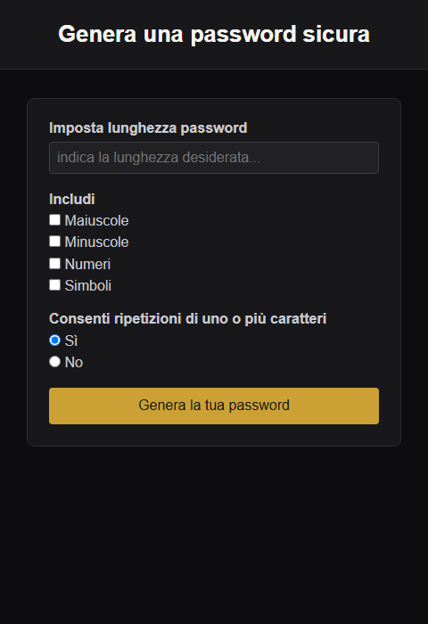
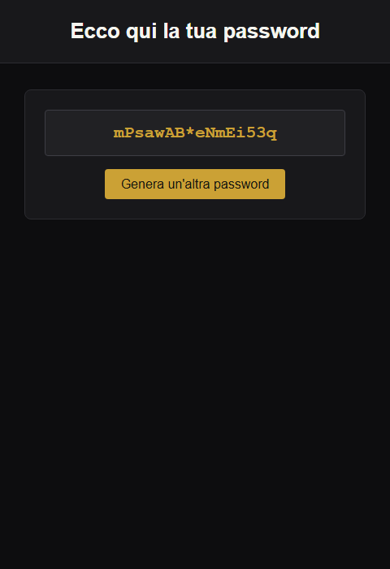
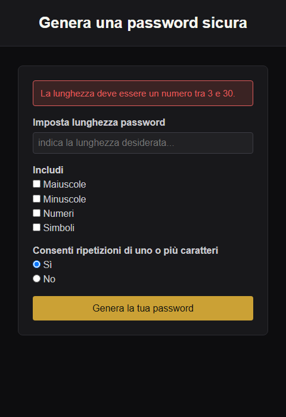

# 🔐 PHP Strong Password Generator

Applicazione web in **PHP puro** per generare password sicure e personalizzabili. Secondo workshop della specializzazione PHP: l'obiettivo è consolidare la gestione di form, sessioni, validazione lato server e organizzazione del codice in funzioni riutilizzabili.

> Nessun framework, nessuna dipendenza esterna: solo PHP, HTML e CSS.

## ✨ Funzionalità

- Generazione di password con lunghezza configurabile (da 3 a 30 caratteri)
- Selezione dei set di caratteri da includere: **maiuscole**, **minuscole**, **numeri**, **simboli**
- Opzione per **consentire o escludere la ripetizione** dei caratteri
- Validazione lato server di tutti i parametri, anche se manomessi via URL
- Messaggi di errore chiari in caso di input non validi (es. lunghezza fuori range, set di caratteri troppo piccolo per una password senza ripetizioni)
- Passaggio del risultato tra le pagine tramite sessione, con password "usa e getta" (rimossa dalla sessione una volta mostrata)
- Interfaccia semplice e pulita, con tema scuro

## 📸 Screenshot

| Form di generazione | Risultato | Validazione errori |
| --- | --- | --- |
|  |  |  |

## 🎯 Obiettivi del workshop

Il progetto è stato sviluppato seguendo una serie di milestone incrementali:

1. **Milestone 1** — Creazione di un form che invia in `GET` la lunghezza desiderata della password. Una funzione genera una password casuale (lettere minuscole, maiuscole, numeri e/o simboli) della lunghezza specificata. Logica e layout inizialmente in un unico file `index.php`.
2. **Milestone 2** — Estrazione della logica di generazione in un file dedicato `functions.php`, incluso poi nella pagina principale, per separare logica e presentazione.
3. **Milestone 3 (bonus)** — Introduzione di un redirect verso una seconda pagina, `result.php`, dedicata alla visualizzazione del risultato. La password generata viene passata tra le pagine tramite sessione.
4. **Milestone 4 (bonus)** — Possibilità per l'utente di scegliere quali set di caratteri includere nella password (maiuscole, minuscole, numeri, simboli), oltre all'opzione di consentire o meno la ripetizione dei caratteri.

## 🛠️ Stack tecnico

- **PHP** (nessun framework)
- **HTML5** / **CSS3**
- Generazione di numeri casuali crittograficamente sicuri tramite [`random_int()`](https://www.php.net/manual/en/function.random-int.php)
- Gestione dello stato tra le pagine con `$_SESSION`

## 📁 Struttura del progetto

```
php-strong-password-generator/
├── assets/                # Screenshot usati in questo README
├── css/
│   └── style.css          # Stili dell'applicazione (tema scuro)
├── src/
│   └── functions.php      # Logica di generazione e validazione
├── index.php              # Form di generazione password
├── result.php             # Pagina di visualizzazione del risultato
└── README.md
```

## 🚀 Come avviare il progetto

### Requisiti

- PHP 8.0 o superiore
- Un server web (es. [XAMPP](https://www.apachefriends.org/), Apache, Nginx) oppure il server integrato di PHP

### Con XAMPP

1. Clona o copia il progetto nella cartella `htdocs` di XAMPP:
   ```bash
   git clone https://github.com/francesco-cassese/php-strong-password-generator.git
   ```
2. Avvia Apache dal pannello di controllo di XAMPP
3. Visita [http://localhost/php-strong-password-generator/](http://localhost/php-strong-password-generator/)

### Con il server integrato di PHP

```bash
git clone https://github.com/francesco-cassese/php-strong-password-generator.git
cd php-strong-password-generator
php -S localhost:8000
```

Poi visita [http://localhost:8000](http://localhost:8000).

## 🔎 Come funziona

1. **`index.php`** mostra il form di configurazione. Alla sottomissione (metodo `GET`), i parametri vengono letti, validati e utilizzati per generare la password tramite le funzioni in `src/functions.php`.
2. La password generata viene salvata in `$_SESSION` e l'utente viene reindirizzato a **`result.php`**.
3. **`result.php`** legge la password dalla sessione, la mostra e la rimuove immediatamente dallo storage (pattern "usa e getta"), evitando che rimanga accessibile ricaricando la pagina.
4. In caso di parametri non validi (es. lunghezza fuori range o set di caratteri incompatibile con l'opzione "niente ripetizioni"), l'utente viene rimandato al form con un messaggio d'errore.

## 👤 Autore

**Francesco Cassese**
